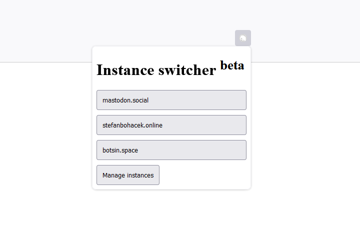
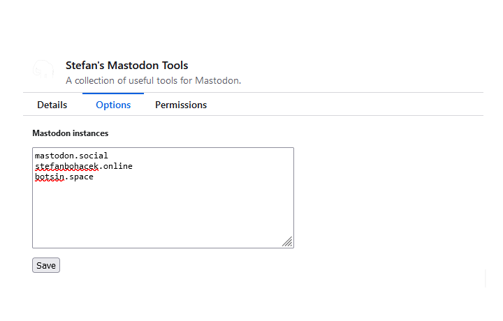
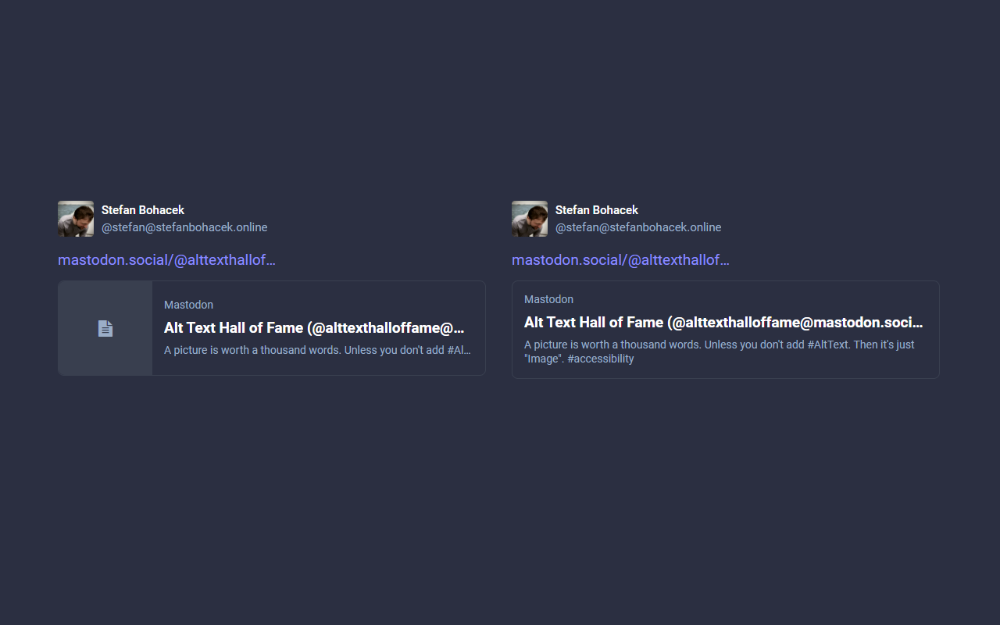
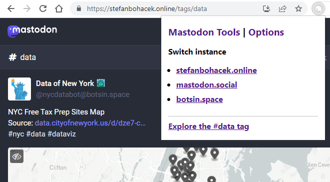
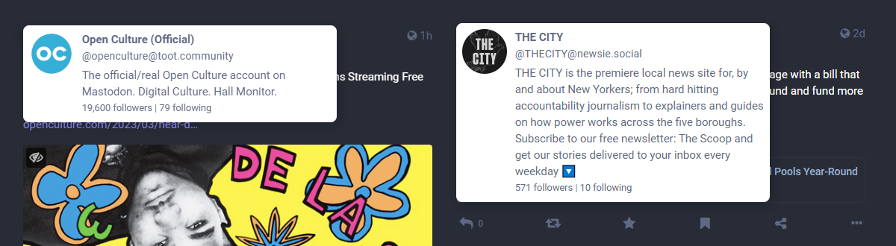

# Mastodon Tools

**[Add to Firefox](https://addons.mozilla.org/en-US/firefox/addon/stefan-s-mastodon-tools/) | [Add to Chrome](https://chrome.google.com/webstore/detail/stefans-mastodon-tools/ngcnchkkkmneongkenppjocbfcoalfjn)**

You can also install the development version of this extension:

- [Firefox](https://developer.mozilla.org/en-US/docs/Mozilla/Add-ons/WebExtensions/Your_first_WebExtension#installing)
- [Chrome](https://developer.chrome.com/docs/extensions/mv3/getstarted/development-basics/#load-unpacked)

Feel free to [open a new issue](https://github.com/stefanbohacek/mastodon-tools/issues?q=is%3Aissue+is%3Aopen+sort%3Aupdated-desc) to report a bug or request a feature, or [reach out privately](https://stefanbohacek.com/contact/).

## Features

### Mastodon instance switcher

Clicking the extension icon lets you open a currently viewed post on another instance. On the extension settings you can specify one or more instances you use and want to switch between.

Each instance domain (omit the http or https protocol) goes on a separate line.

### Expanded quote post previews

Quoted posts will now show the full text!

### Tag browser

When viewing a tag page on Mastodon, a link will be added to the plugin pop-up window that lets you browse the current tag across a larger portion of the fediverse using the [Fediverse Explorer](https://fediverse-explorer.stefanbohacek.dev/), another tool I've developed.

## Experimental features

### Profile hovercards

This feature is on [Mastodon's roadmap](https://joinmastodon.org/roadmap), under "Exploring" as "On-hover information cards for users", but you don't have to wait!

Note that this feature is under active development and you will need to enable it in the settings. It is currently only available in Chrome.

## Known issues

See also [open issues in this repo](https://github.com/stefanbohacek/mastodon-tools/issues?q=is%3Aissue+is%3Aopen+sort%3Aupdated-desc).

### Profile hovercards

- Hovercards don't work for accounts with handles `account@example.com` if Mastodon itself is running at `subdomain.example.com`.
- Hovercards don't work for accounts on some non-Mastodon servers.
- Hovercards for accounts mentioned in profile bio are not positioned correctly.

## TODO

- ~~When data is not available, show profile picture from the post and a note explaining the lack of data.~~
